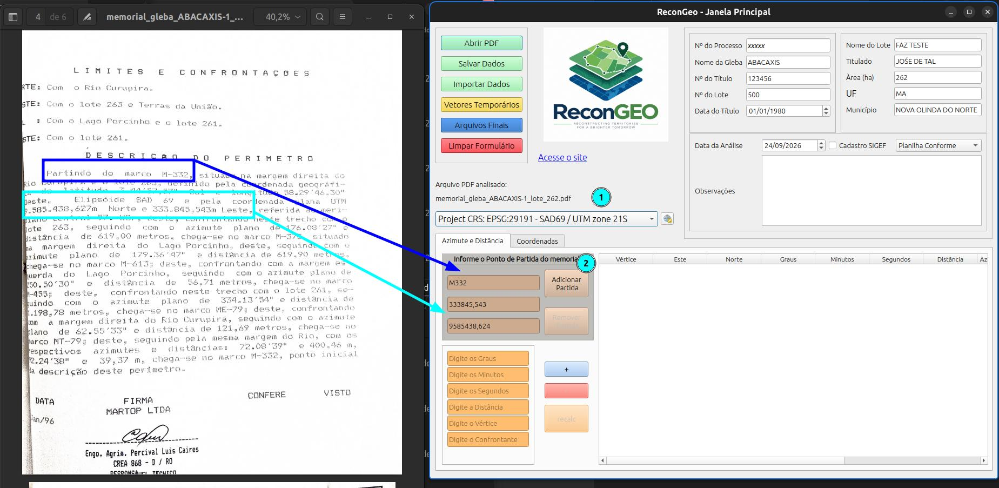
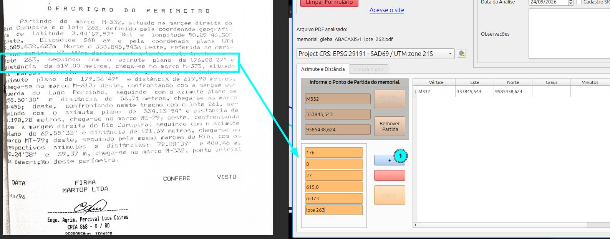
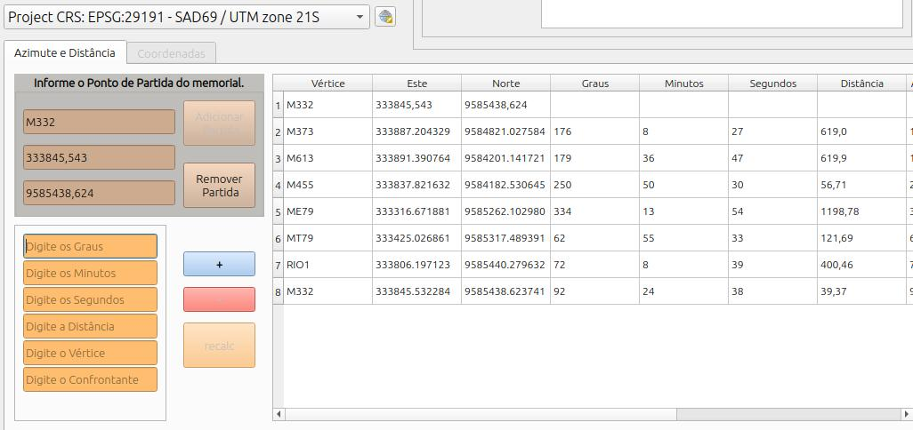
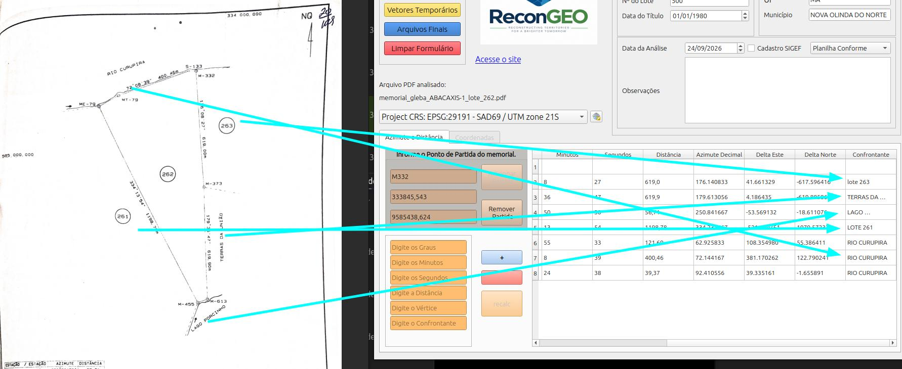
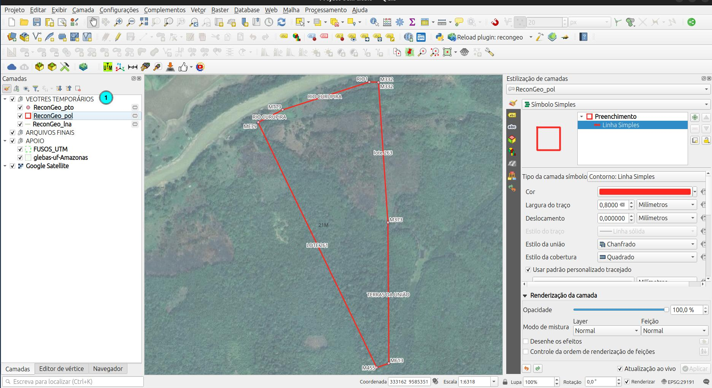
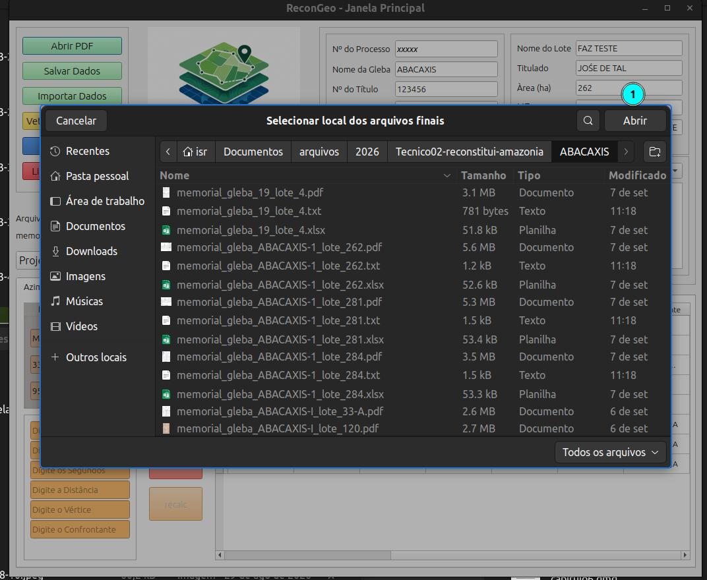
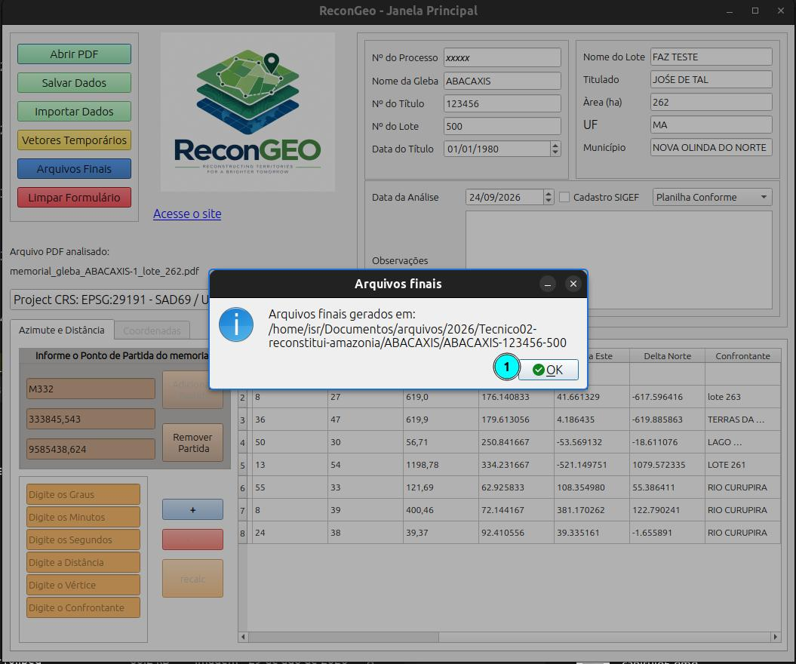
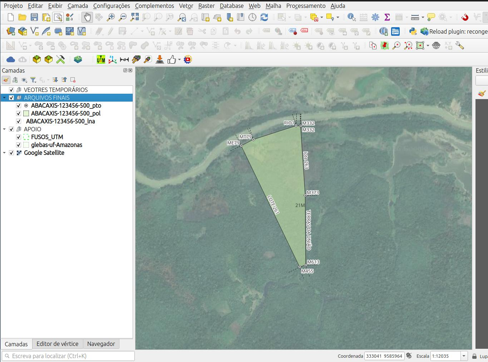
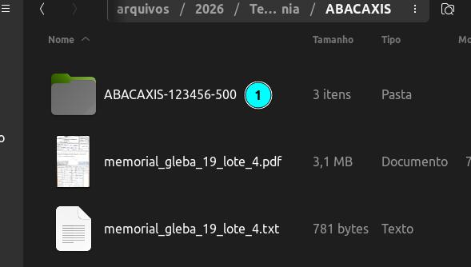
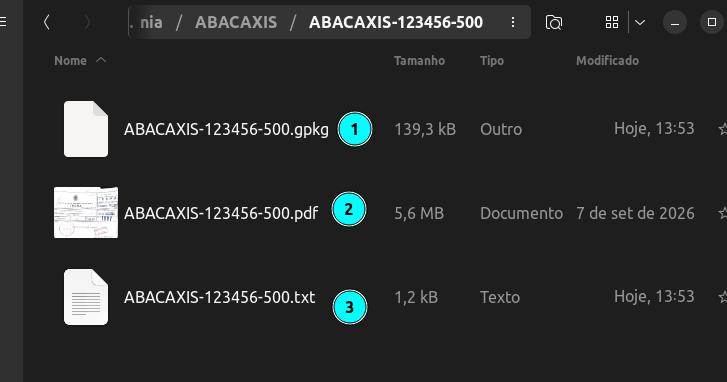

# Memorial de azimute e distância.

Inserimos as informações inciais para o memorial e adicionamos o ponto de partida à tabela.

::: {.callout-note}
1. Selecione o SRC, nesse caso SAD69 UTM 21S;
2. preencha as informações do ponto de partida e clique em Adicionar partida.
:::

Digite as informações do caminhamento seguindo as informações do azimute e distância conforme o memorial e clique no botão de adicionar (+).

Repita o processo até a inserção de toas as informações. CAso não tenha o confrontante, preencha com "xxx" por exemplo e edite na tabela posteiormente.

## Informando as confrontações

No memroial pode não existir as confrontações ou essas iformações pode estar incompletas. Podemos editar a tebela usando a planta do processo como referência dando dois cliques sobre a célula que deseja editar.

## Gerando os vetores temporários

::: {layout-ncol="2"}
Após preencher as informações da tabela, podemos clicar no botão para gerar os vetores temporários para visualizar os arquivos reconstituídos.

:::

Comparando o desenho com o mapa do processo podemos classificar essa reconstituição como **Planilha Conforme**.

## Gerando os arquivos finais

::: {layout-ncol="2"}
Após a conferência dsa informações, poderemos gerar os **Arquivos Finais**. Clique no botão correspondente e informe o local onde a pasta será criada e os arquivos salvos.

:::

::: {.callout-note}
1. Local de salvamento.
:::

::: {.callout-note}
1. Mensagem de confirmação.
:::

## Arquivos definitivos

Os aquivos finais serão salvos e os vetores, se existirem, serão carregados no QGIS.

**Arquivos Padronizados**

::: {layout-ncol="2"}
::: {.callout-note}
1. Pasta de arquivos definitivos
:::

::: {.callout-note}
1. Vetores em .GPKG
2. Processo em .PDF
3. Meta dados em .TXT
:::

:::

::: {layout-ncol="2"}
Clique no botão de limpar o formulário para reconstituir outro processo.

:::