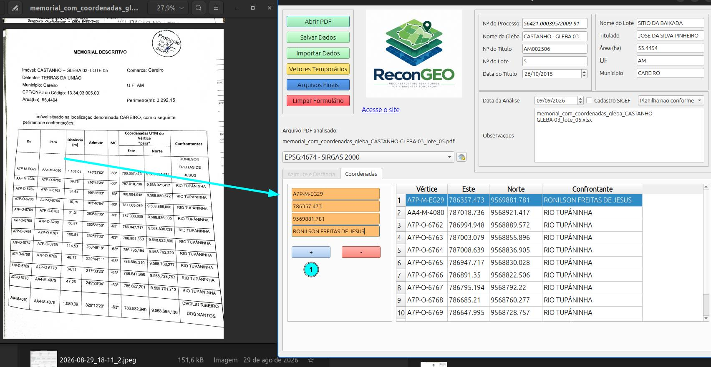
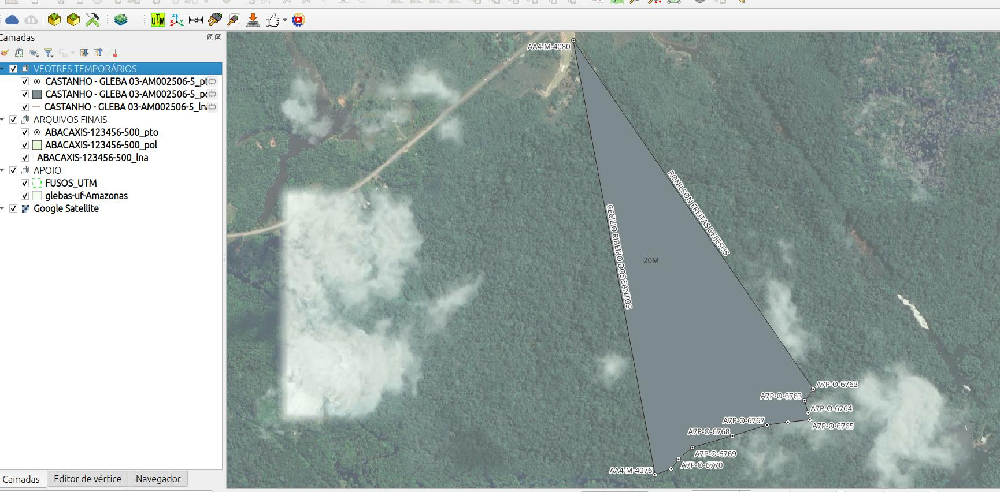
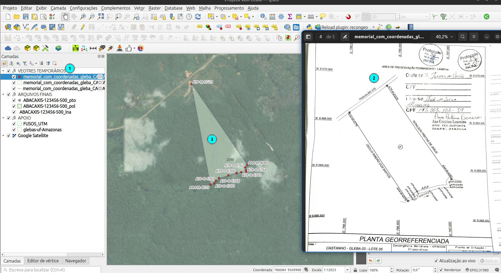
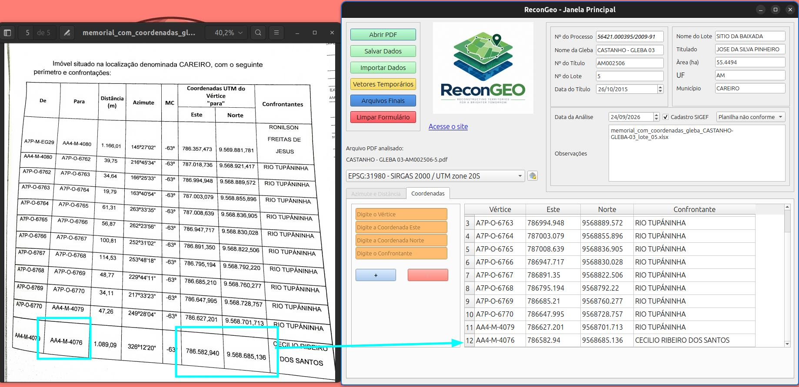
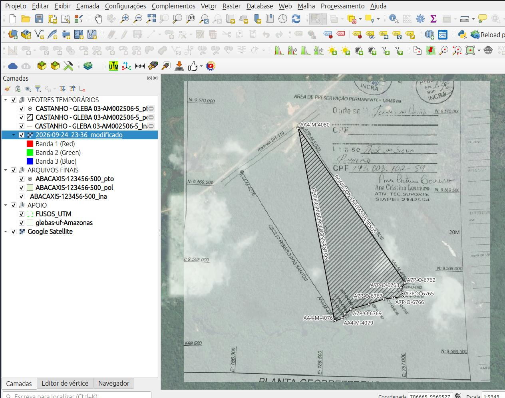
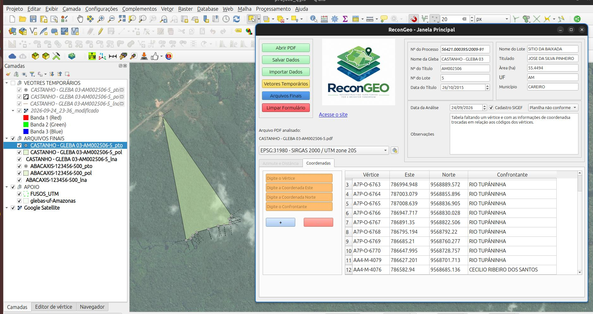

# Memorial por coordenadas

No memorial abaixo temos uma tabela de coordenadas com os vértices já no padrão da certificação do INCRA. Note que o mesmorial traz a seguinte informação na coluna de coordenadas, *Coordenadas UTM do vértice "para"*. 

## Verificando o desenho temporário

O desenho gerado não corresponde ao mapa da documentação.

::: {.callout-note}

1. Vetores temporários do ReconGeo
2. Mapa do processo.

:::

**Conferência da tabela de coordenadas**

::: {layout-ncol="2"}

A tabela de coordenadas deve ser revisada para verificação de erros de digitação. Nada Foi encontrado, assim, marcamos a reconstituição como **Planilha não conforme**, ou seja, os dados informados não geram o desenho do processo.

:::

## Análise

A análise do mapa do processo no QGIS mostra que, apesar da informação na tabela de coordenadas mostrar que os valores de **Este** e **Norte** são correspondentes aos vértices da coluna **"para"**, o desenho mostra o ponto de código **"AA4-M-4080"** no local do ponto **"A7P-M-EG29"**, e a falta de um vértice na tabela, o desenho possui **13 vértices**, mas a tabela está com **12 vértices**.

A planta do processo foi georreferenciada para comparação.

## Arquivos finais

A observação é anotada e os arquivos finais são gerados segundo os dados do processo.

