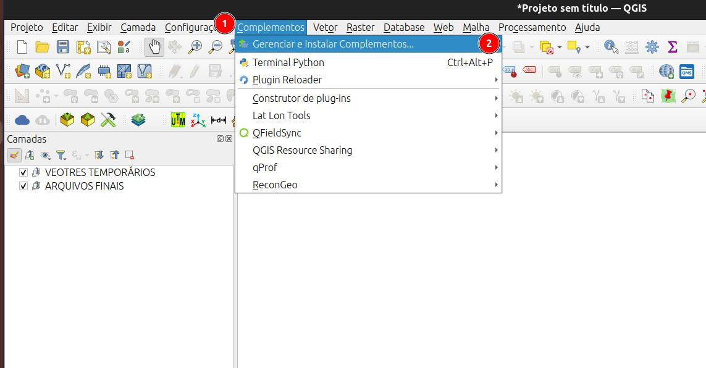
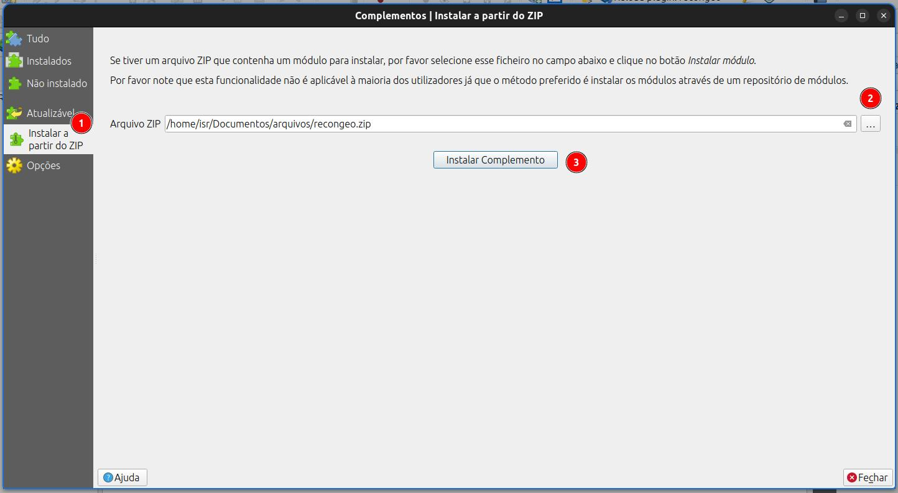
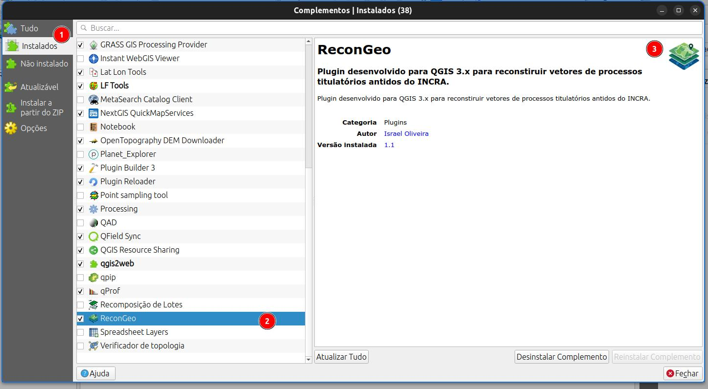
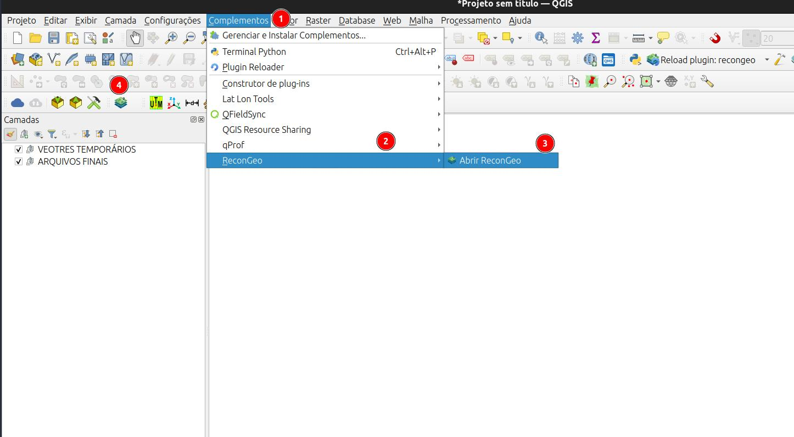

# Instalação

O plugin é distribuído via arquivo .zip para ser instalado no QGIS 3.x.

## Complementos do QGIS

::: {.callout-note}
1. Clique no menu Complementos
2. Depois em Carregar e instalar complementos.
:::

::: {.callout-note}
1. Clique em instalar a partir do ZIP.
2. Clique no botão e selecione o arquivo .zip do plugin.
3. Clique em Instalar complemento.
:::

::: {.callout-note}
1. Clique em instalados
2. Veja se aparece o pluin Recongeo na lista
3. Veja o ícone do plugin
:::

Ainda na janela de Complementos verifique se o plgin aparece na seção de instalados.

Pode fecha essa janela.

O plugin pode ser acessado pelo menu de Complementos ou pelo ícone nas ferramentas.

::: {.callout-note}
1. Clique no menu Complementos
2. Depois em ReconGeo
3. Abrir ReconGeo.
4. ou Clique no ícone do plugin
:::

