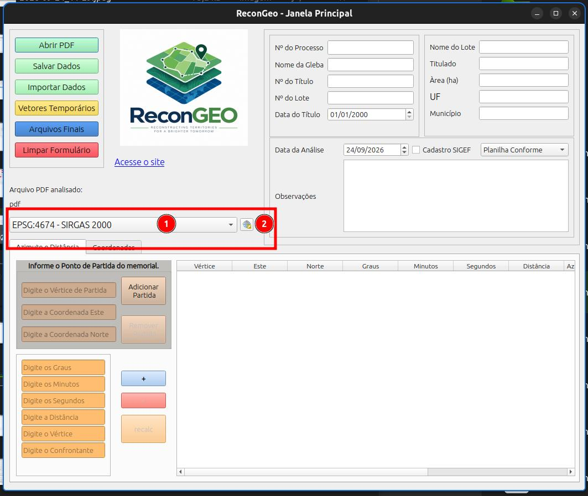
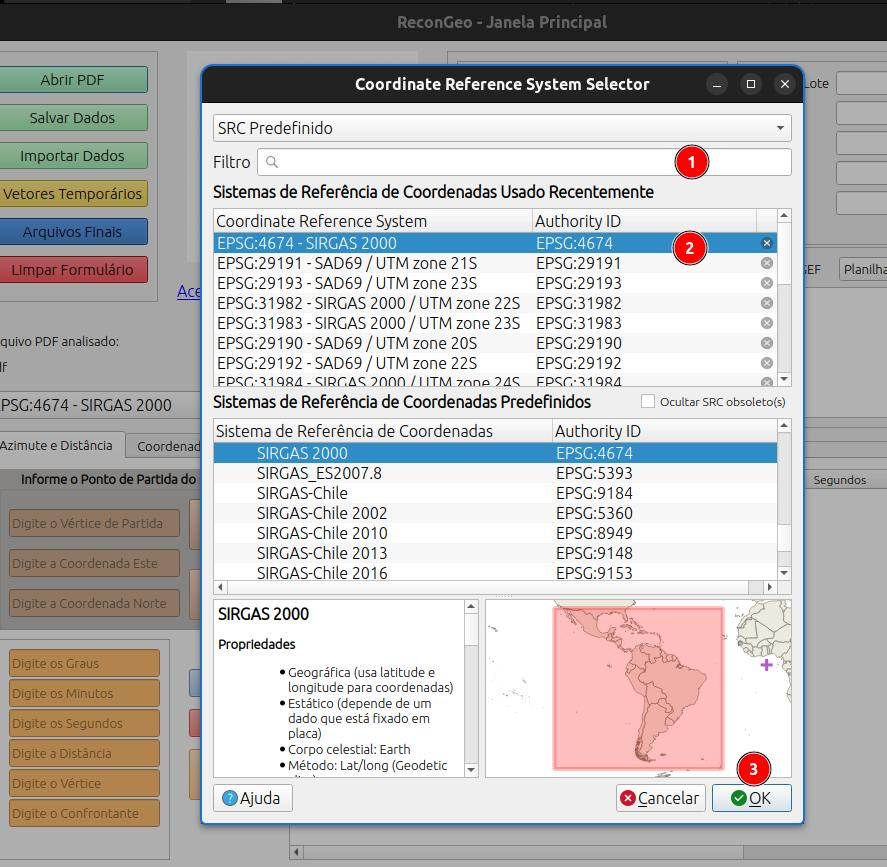
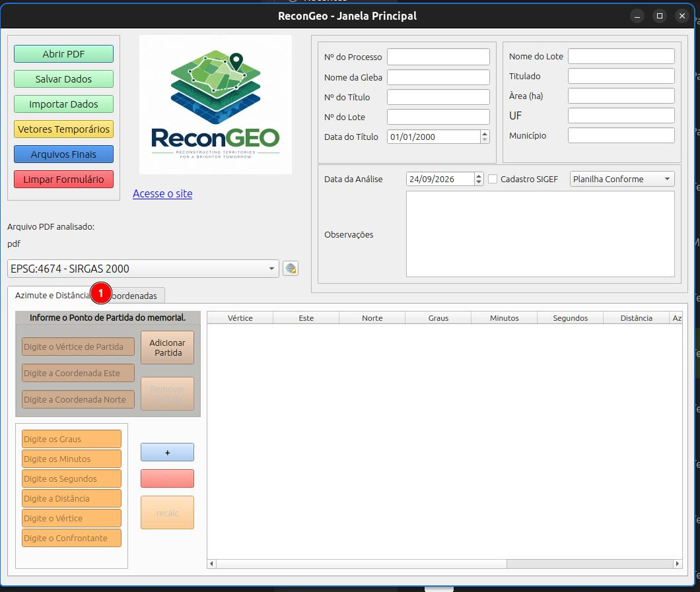
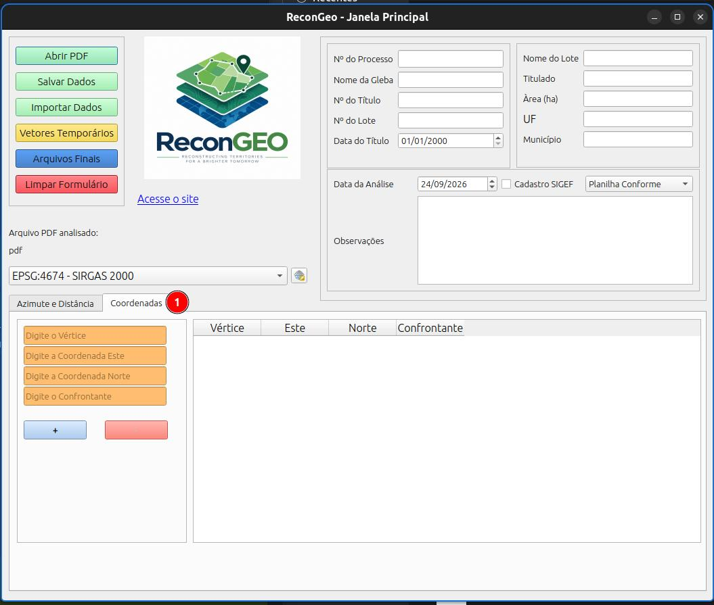
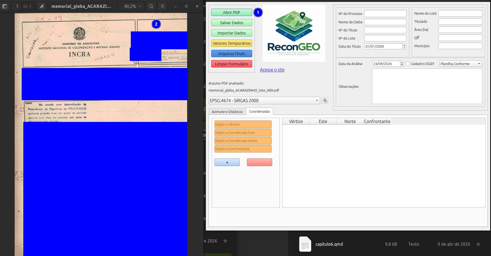
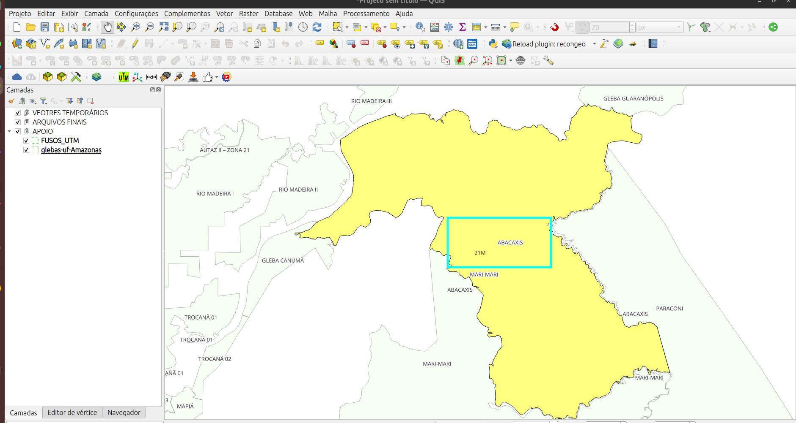

# Guia rápido de uso do plugin Recongeo.

## Instalação

O plugin é distribuído via arquivo .zip para ser instalado no QGIS 3.x.

### Complementos do QGIS

::: {.callout-note}
1. Clique no menu Complementos
2. Depois em Carregar e instalar complementos.
:::

::: {.callout-note}
1. Clique em instalar a partir do ZIP.
2. Clique no botão e selecione o arquivo .zip do plugin.
3. Clique em Instalar complemento.
:::

::: {.callout-note}
1. Clique em instalados
2. Veja se aparece o pluin Recongeo na lista
3. Veja o ícone do plugin
:::

Ainda na janela de Complementos verifique se o plgin aparece na seção de instalados.

Pode fecha essa janela.

O plugin pode ser acessado pelo menu de Complementos ou pelo ícone nas ferramentas.

::: {.callout-note}
1. Clique no menu Complementos
2. Depois em ReconGeo
3. Abrir ReconGeo.
4. ou Clique no ícone do plugin
:::

## Usando o plugin

### Tela Principal

Abaixo são apresentadas as principais funcionalidades.

::: {.callout-note}
1. Botão para abrir o PDF com as informações do processo a ser reconstituído;
2. Botão para salvar os dados do formulário de forma temporária para finalização posterior.
3. Carrega um arquivo .txt do plugin com as informações do formulário salvas anteriormente.
4. Gerar os vetores em memória (temporários) na tela de mapas do QGIS para verificação da reconstituição.
5. Gerar os arquivos finas com um nome padrão: .gpkg, .pdf e .txt
6. Limpa os dados do formulário.
:::

A verificação do desenho entes da finalização mostra como a figura e os dados digitados irão ficar, podendo evidenciar erros de digitação ou de seleção de sistema de coordenandas.

### Seção de infomações gerais

::: {.callout-note}
1. Informar o número do processo administrativo
2. Informar o nome da gleba, usar "-" pra separar informações
3. Informar o número do título
4. Informar o número do lote
5. Informar a data de emissão do título
6. Informar o nome do lote
7. Informar o nome do titulado
8. Informar a área em hectares do lote
9. Informar a sigla do estado
10. Informar o nome do município
11. A data de análise é preenchida automaticamente com a data atual
12. Marcar caso o documento analisado tenha sido inserido no SIGEF, colocar o código SIGEF ou o CPF do tilutado nas observações;
13. Selecionar o tipo de reconstituição conforme o desenho teporário e os dados da tabela.
    1.  Planilha conforme: os dados estão de acordo com o memorial e a planta saiu conforme o mapa da documentação (pdf)
    2.  Planilha incompleta: os dados do memorial foram digitados mas não foi possível completar a poligonal, casos em confrontação com rios ou estradas.
    3.  Planilha não comforme: os dados foram digitados e conferidos mas o vetor NÃO corresponde ao mapa da documentação (pdf)
    4.  Sem planilha: os dados contidos na documentação NÃO possibilitam a digitação da planilha;
14. Informar algum dado relevante ou erro na reconsttituição.
:::

Para todos os PDF de processos devem ser preenchidas as informações desta seção, no caso de processos sem planilha, serão gerados apensa o .txt e o .pdf padronizado na pasta para entrega final.

### Arquivo pdf analisado

Quando abrimos um arquivo pdf pelo plugin, o nome aparece na seção **Arquivo PDF Analisado.**

::: {.callout-note}
1. Nome do arquivo PDF analisado
:::

### Sistema de referência de coordenadas dos vetores (SRC)

::: {.callout-note}
1. Selecione o SRC na lista dos já utilizados;
2. ou clique no botão de buscar para selecionar ou SRC
:::

::: {.callout-note}
1. Digite o nome do SRC para filtrar na lista;
2. selecione o sistema desejado
3. clique em OK.
:::

## Informações cartográficas do memorial

As planilhas de coordenadas a serem digitadas com as informações do processo podem ser de dois tipos: 

- Baseadas em Azimutes e distâncias: nesse modelo o memorial apresenta-se no formato de texto, geralmente, onde identificamos um vértice de partida com uma coordenada, e segue-se informando os ângulos (azimute) e as distâncias até o fechamento da poligonal.
- Tabela de Coordenadas: nesse modelo o memorial vem em formato de tabela contendo colunas com os vértices, coordenada Este e coordenada Norte.

**Azimute e Distância**

**Coordenadas**

## Procedimento de Reconstituição

### Carregando o PDF

::: {.callout-note}
1. Clique no botão de abrir pdf
2. Verifique as informações do documento
:::

### Coletando informações na base cartográfica.

Com as informações cartográficas de apoio como as poligonais de glebas federais, e a grade de fusos UTM, podemos identificar as informações omissas no memorial. A gleba em questão está localizada no fuso UTM 21S.

### Memorial de azimute e distância.

Inserimos as informações inciais para o memorial e adicionamos o ponto de partida à tabela.

::: {.callout-note}
1. Selecione o SRC, nesse caso SAD69 UTM 21S;
2. preencha as informações do ponto de partida e clique em Adicionar partida.
:::

Digite as informações do caminhamento seguindo as informações do azimute e distância conforme o memorial e clique no botão de adicionar (+).

Repita o processo até a inserção de toas as informações. CAso não tenha o confrontante, preencha com "xxx" por exemplo e edite na tabela posteiormente.

### Informando as confrontações

No memroial pode não existir as confrontações ou essas iformações pode estar incompletas. Podemos editar a tebela usando a planta do processo como referência dando dois cliques sobre a célula que deseja editar.

### Gerando os vetores temporários

Após preencher as informações da tabela, podemos clicar no botão para gerar os vetores temporários para visualizar os arquivos reconstituídos.

Comparando o desenho com o mapa do processo podemos classificar essa reconstituição como **Planilha Conforme**.

### Gerando os arquivos finais

Após a conferência dsa informações, poderemos gerar os **Arquivos Finais**. Clique no botão correspondente e informe o local onde a pasta será criada e os arquivos salvos.

Local de salvamento.

Mensagem de confirmação.

### Arquivos definitivos

Os aquivos finais serão salvos e os vetores, se existirem, serão carregados no QGIS.

**Arquivos Padronizados**

Pasta com os arquivos

Arquivos salvos

Clique no botão de limpar o formulário para reconstituir outro processo.

### Memorial por coordenadas

No memorial abaixo temos uma tabela de coordenadas com os vértices já no padrão da certificação do INCRA. Note que o mesmorial traz a seguinte informação na coluna de coordenadas, *Coordenadas UTM do vértice "para"*. 

### Verificando o desenho temporário

O desenho gerado não corresponde ao mapa da documentação.

**Conferência da tabela de coordenadas**

A tabela de coordenadas for revisada para verificação de erros de digitação. Nada Foi encontrado, assim, marcamos a reconstituição como **Planilha não conforme**, ou seja, os dados informados não geram o desenho do processo.

A análise do mapa do processo no QGIS mostra que, apesar da informação na tabela de coordenadas mostrar que os valores de Este e Norte são correspondentes aos vértices da coluna "para", o desenho mostra o ponto de código "AA4-M-4080" no local do ponto "A7P-M-EG29", e a falta de um vértice na tabela, o desenho possui 13 vértices, mas a tabela está com 12.

### Arquivos finais

A observação é anotada e gerado os arquivos finais segundo os dados do processo.

## Função de remover linha

Nas duas tabelas é possível deletar uma linha já digitada, basta selecionar a linha desejada e clicar no botão (-). A tabela de azimute e distância, dependendo da linha eliminada, será necessário o recálculo das coordendas das linhas abaixo, esse funcionalidade é explicada abaixo.

## Recálculando a tabela de azimute e distência.

Na tabela de azimute e distancia, as coordenadas dos pontos seguintes ao ponto de partida são calculadas com base nos dados do vértice anterior, assim, caso haja uma modificação na tabela em uma determinada linha, as informações seguintes necessitam ser recalculadas.

**Caso de estudo**

Abaixo temos o caso do lote 344 na gleba Frades no Maranhão.

A planta menciona o Rio Lontra como marco no memorial descritivo.

Como não há os azimutes desse trecho, apenas a distância, as coordenadas seguintes ficam prejudicadas, refletindo no desenho dos vetores temporários.

Podemos utilizar bases cartográficas como apoio na definição da coordenada do ponto **MG508** para que a reconstituição assuma um formato coerente. Esse tipo de procedimento não está normatizado pelo INCRA!

Nesse caso foi utilizado as cartas do plugin BDGex para localizar o Rio Lontra.

Foi traçado uma linha com a distância mencionada no memorial.

A coordenada foi estimada pela tela do QGIS, lembrando que o sistema de coordenadas do projeto deve ser configurado conforme o do memorial.

A coordenada estimada para o ponto **MG508** no EPSG 29193 seria Este 169266,8 e Norte 9439927,0.

Abaixo temo a planilha antes da correção.

Vamos editar a tebela na linha 2 informando as coordenadas estimadas.

Para efetuar o procedimento de recalcular as linhas subsequentes, temos que selecionar a linha logo abaixo da partida (a que foi modifiacda) e clicar no botão **recalc**.

Comparando as tabelas antes e após o recálculo podemos notar a modificação das coordenadas.

Com os novos vetores podemos georreferenciar o mapa do processo e verificar o resultado.

1. Mapa do lote que consta no processo analisado.