# Recálculando a tabela de azimute e distência.

Na tabela de azimute e distancia, as coordenadas do vértice posterior (**vante**) é calculada com base no vértice anterior (**ré**), assim, caso haja uma modificação na tabela em uma determinada linha, as informações seguintes necessitam ser recalculadas.

**Caso de estudo**

Abaixo temos o caso do lote 344 na gleba Frades no Maranhão.

A planta menciona o Rio Lontra como marco no memorial descritivo.

**Planta do processo**
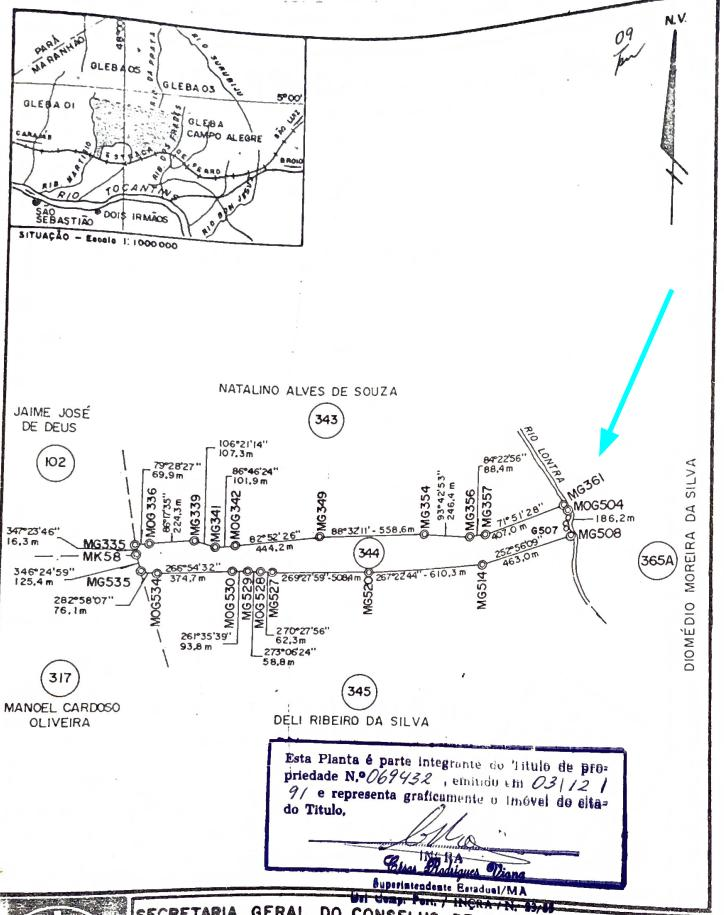

**Memorial descritivo do processo**
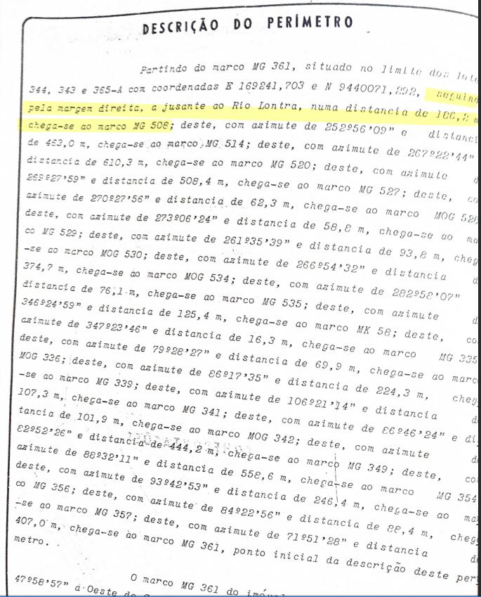

Como não há os azimutes do trecho do rio, apenas a distância, as coordenadas seguintes ficam prejudicadas, refletindo no desenho dos vértices posteriores.

**Desenho dos vetores temporários conforme memorial**
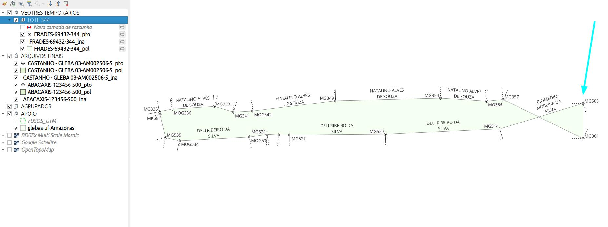

## Estimando a coordenada do rio

Podemos utilizar bases cartográficas como apoio na definição da coordenada do ponto **MG508** para que a reconstituição assuma um formato coerente. Esse tipo de procedimento não está normatizado pelo INCRA!

Nesse caso foi utilizado as cartas do plugin BDGex para localizar o Rio Lontra.

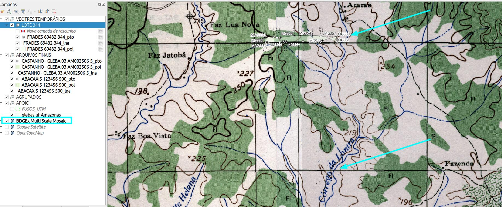

Foi traçado uma linha com a distância mencionada no memorial.

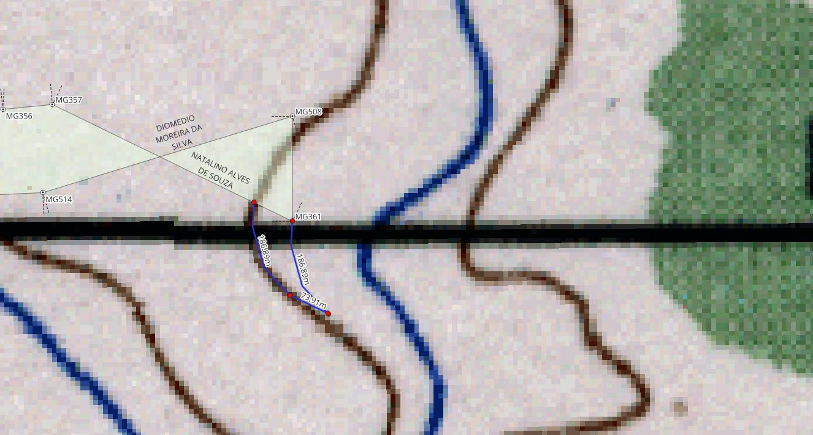

A coordenada foi estimada pela tela do QGIS, lembrando que o sistema de coordenadas do projeto deve ser configurado conforme o do memorial.

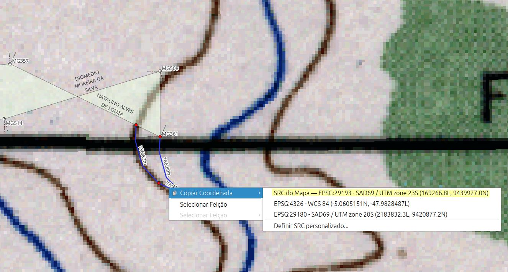

A coordenada estimada para o ponto **MG508** no EPSG 29193 seria Este 169266,8 e Norte 9439927,0.

**Planilha original**

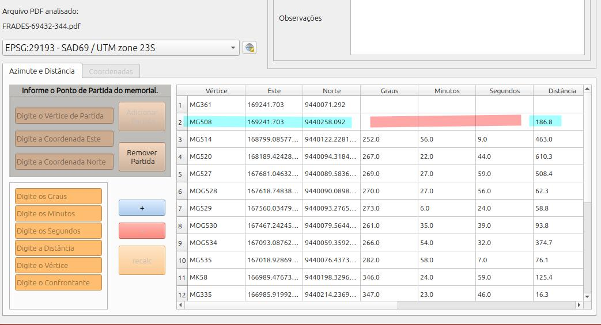

**Editando a coordenada**

Vamos editar a tebela na linha 2 informando as coordenadas estimadas.

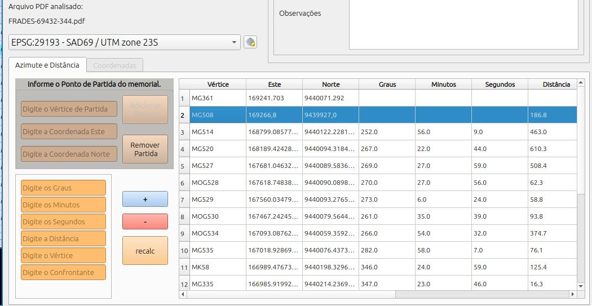

## Recalculando

Para efetuar o procedimento de recalcular as linhas subsequentes, temos que selecionar a linha logo abaixo da partida (a que foi modifiacda) e clicar no botão **recalc**.

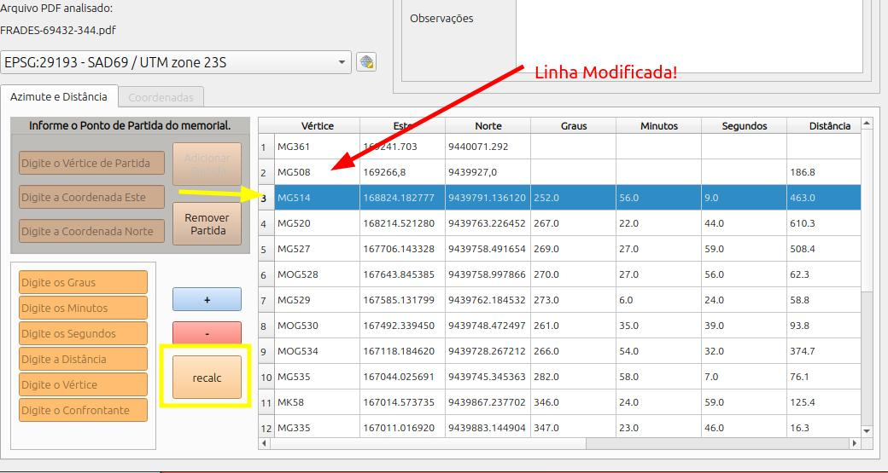

Comparando as tabelas antes e após o recálculo podemos notar a modificação das coordenadas.

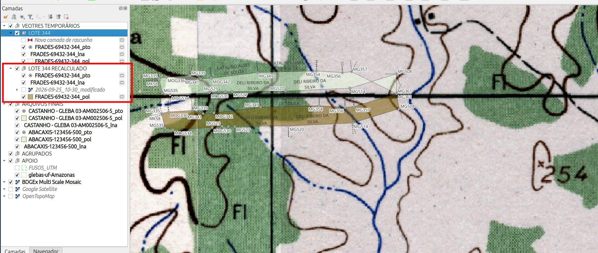

Com os novos vetores podemos georreferenciar o mapa do processo e verificar o resultado.

::: {.callout-note}

1. Mapa do lote que consta no processo analisado.
:::

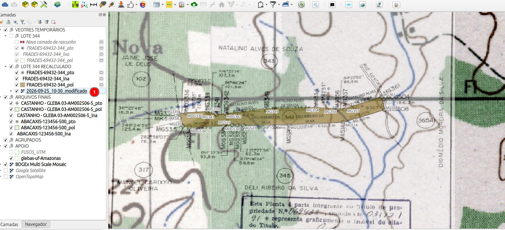