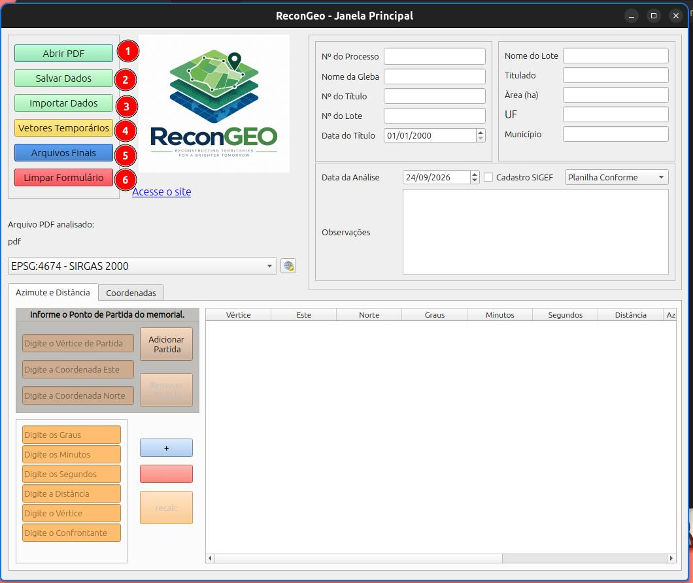
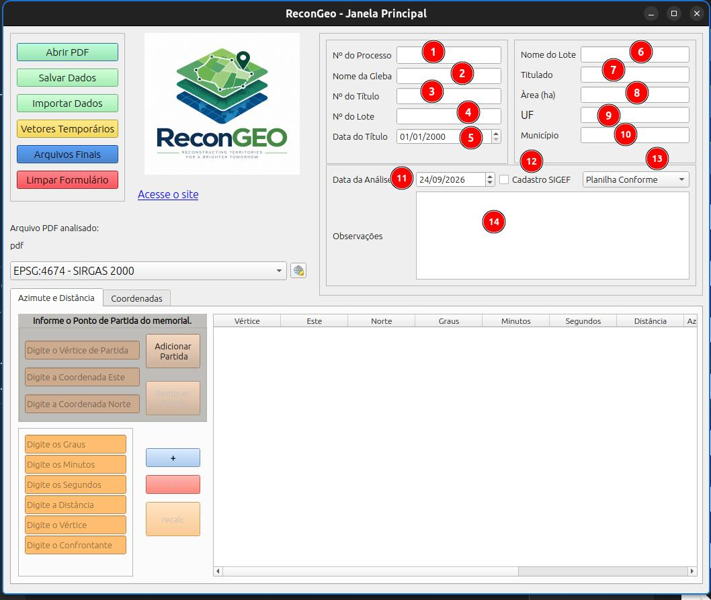

# Tela Principal

Abaixo são apresentadas as principais funcionalidades.

::: {.callout-note}
1. Botão para abrir o PDF com as informações do processo a ser reconstituído;
2. Botão para salvar os dados do formulário de forma temporária para finalização posterior.
3. Carrega um arquivo .txt do plugin com as informações do formulário salvas anteriormente.
4. Gerar os vetores em memória (temporários) na tela de mapas do QGIS para verificação da reconstituição.
5. Gerar os arquivos finas com um nome padrão: .gpkg, .pdf e .txt
6. Limpa os dados do formulário.
:::

A verificação do desenho entes da finalização mostra como a figura e os dados digitados irão ficar, podendo evidenciar erros de digitação ou de seleção de sistema de coordenandas.

## Seção de infomações gerais

::: {.callout-note}
1. Informar o número do processo administrativo
2. Informar o nome da gleba, usar "-" pra separar informações
3. Informar o número do título
4. Informar o número do lote
5. Informar a data de emissão do título
6. Informar o nome do lote
7. Informar o nome do titulado
8. Informar a área em hectares do lote
9. Informar a sigla do estado
10. Informar o nome do município
11. A data de análise é preenchida automaticamente com a data atual
12. Marcar caso o documento analisado tenha sido inserido no SIGEF, colocar o código SIGEF ou o CPF do tilutado nas observações;
13. Selecionar o tipo de reconstituição conforme o desenho teporário e os dados da tabela.
    1.  Planilha conforme: os dados estão de acordo com o memorial e a planta saiu conforme o mapa da documentação (pdf)
    2.  Planilha incompleta: os dados do memorial foram digitados mas não foi possível completar a poligonal, casos em confrontação com rios ou estradas.
    3.  Planilha não comforme: os dados foram digitados e conferidos mas o vetor NÃO corresponde ao mapa da documentação (pdf)
    4.  Sem planilha: os dados contidos na documentação NÃO possibilitam a digitação da planilha;
14. Informar algum dado relevante ou erro na reconsttituição.
:::

::: {.callout-warning}

Para todos os PDF de processos devem ser preenchidas as informações desta seção, no caso de processos sem planilha, serão gerados apensa o .txt e o .pdf padronizado na pasta para entrega final.
:::

